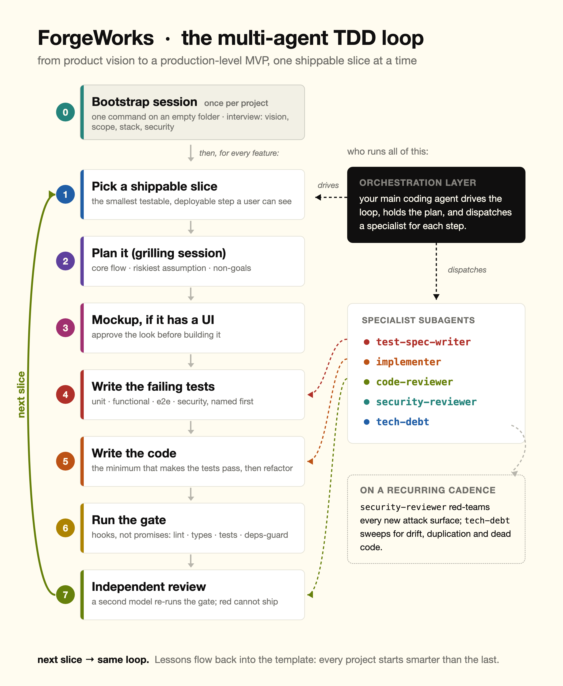

# ForgeWorks

> One command turns an empty folder into a structured, TDD-driven, security-gated project — built for **agentic coding**.

**You don't need a senior engineering team to build like one.** Bring the idea — ForgeWorks wraps your AI coding agent in a senior team's discipline (planning, a real test pyramid, a security review, a second-opinion reviewer), so a product manager, a designer, or a first-week coder can turn a prompt into a product that's actually tested, secure, and shippable — not a throwaway demo.

It is not a starter app. It installs the rules, specialist roles, and deterministic gates that make an AI coding agent produce code you can actually review, ship, and maintain. The core is stack-agnostic; your language and tooling are chosen in a short interview, not hard-coded.

```bash
mkdir my-project && cd my-project && git init
bash <(curl -fsSL https://raw.githubusercontent.com/Kpakfar/ForgeWorks/v1.1.4/bootstrap/install.sh)
# then open your agent and run:  /init-project
```

## Why use it

- **Works with any agentic coder.** The whole constitution lives in `AGENTS.md` (symlinked to `CLAUDE.md`) — the cross-tool standard read by Claude Code, Codex, Cursor, opencode, and others. The rules and docs (`AGENTS.md`) are portable to any agent; the deep orchestration and local gates (subagents, hooks, MCP) run in Claude Code today, and other agents ignore the Claude-specific parts gracefully.
- **Two agents, two perspectives.** Drive with your primary agent and bring a **second one as an independent reviewer** — e.g. **Codex** (opt in during setup) — for a genuine second opinion on important changes. Two models reviewing beats one.
- **Plans from the heart, not lazily — on every slice.** A structured discovery — brainstorm the options, then grill the plan: core flow, riskiest assumption, non-goals, named test plan, a proactive "what's missing?" pass — is signed off *before* any code, for **every** feature and cycle, not just at setup. UI-heavy slices get a real mockup to approve *before* implementation.
- **The whole test pyramid, at spec time.** Unit + functional/API + headless-browser e2e + security tests are named in the plan and written first (Red phase).
- **Security is enforced, not requested.** Access-control/IDOR, secrets, supply chain, and (for AI apps) prompt-injection defenses live in `AGENTS.md` + `docs/SECURITY.md`, backed by a real `PreToolUse` supply-chain hook (a best-effort guard, not a sandbox) — because prompt-level security is theater.
- **Self-improving & upgradeable.** Lessons flow back into the template; existing projects pull updates with `/upgrade-project`, non-destructively.

## What you get

- **`AGENTS.md` constitution** — architecture, security, test, planning, and design (mockup-over-ASCII) discipline, all in one source of truth.
- **5 subagents** — `@test-spec-writer`, `@implementer`, `@code-reviewer` (+ optional Codex second opinion), `@security-reviewer`, `@tech-debt`.
- **Deterministic gates** — a verify-only `qa` (plus a local `fix`), a supply-chain `deps-guard` hook, and CI (fast gate + separate e2e job).
- **Living docs** — product vision, requirements, structure, gotchas, SECURITY, and a shared current-task scratchpad agents read and write.
- **Batteries** — Context7 MCP for live library docs, an optional dev container, a green-on-first-run scaffold, a PR template, and a pre-commit config (Python profile only).

## How it works

The main agent orchestrates the loop; `tdd` and `grill-me` (from `mattpocock/skills`) drive the methodology and planning. Three subagents pair with the per-slice **Red → Green → Refactor → Review** loop; two more run on a recurring cadence. Sub-1h tasks skip the ceremony entirely. The same gate runs locally (a `Stop` hook that blocks a red build) and in CI.



## Upgrade an existing project

Run the **same command** inside it — `install.sh` detects a generated project and installs `/upgrade-project` instead of bootstrapping:

```bash
bash <(curl -fsSL https://raw.githubusercontent.com/Kpakfar/ForgeWorks/v1.1.4/bootstrap/install.sh)
# then run:  /upgrade-project
```

It reconciles your project against the current template — copying missing files and grafting new rule blocks **without overwriting your content**. Non-destructive and idempotent. (Never re-run `/init-project` on an existing project; that overwrites your filled-in docs.)

## Repo layout

```
bootstrap/        seed kit + install.sh (bootstraps empty dirs, routes existing ones to upgrade)
init-project/     /init-project skill — interview + generation; templates/core/ + templates/profiles/<lang>/
upgrade-project/  /upgrade-project skill — non-destructive reconcile for existing projects
docs/             how-to-use.md and ROADMAP.md
VERSION           stamped into generated projects
```

## Languages

**Python, TypeScript, and Go** are complete profiles — pick any in the interview and you get only that language's toolchain (no cross-language leakage). All three are verified green on the first run by CI, on the **merged core+profile tree** (the exact shape a generated project has). Rust and "Other" aren't built yet (the interview tells you so and gets consent). Adding a language is a documented recipe (`docs/how-to-use.md`). Releases are versioned tags (current: `v1.1.4`): a pinned tag gives you the same template files tomorrow, though runtime inputs (npm/degit/Context7) aren't fully reproducible yet — see `docs/ROADMAP.md`.

## Status

ForgeWorks is an opinionated, agent-driven harness — a capable v1 with a clear roadmap, not a finished deterministic product. Be aware of what is and isn't mechanically true today:

- **Generation is executed by an AI agent following a skill, not a deterministic engine.** The interview and file substitution are driven by an agent, not a renderer with golden-fixture tests (that's roadmap — see `docs/ROADMAP.md`).
- **The supply-chain guard is best-effort.** The `deps-guard` hook reduces risk; it is not a sandbox. The real controls are lockfile review and CI scanning.
- **Profiles:** Python, TypeScript, and Go are each verified green in CI on the merged core+profile tree, quality gate and e2e runner included.

## License

MIT. Use it, change it.
